# College Wifi Autoconnector

A tool that automatically logs you into college WiFi whenever Windows detects a network change, without having to use a browser, and keep a tab open in the background.

This tool was written with ONLY IIITU's wifi situation in mind, it will most likely **NOT WORK IF YOU AREN'T IN IIITU.**

## Features
- Auto login to WiFi captive portal.
- Runs silently and automatically in the background using a Windows Task Scheduler event.
- Written in C++ for minimal background resource usage

## Installation

### 1. Get the Program
- Download the `wifitool.exe` program from the releases tab, or build it yourself (windows only).

> [!WARNING]
> If the captive portal on your network is not hosted on `192.168.100.1`, you will need to change the hardcoded url and build the program yourself. This might become a command line argument later. 

### 2. Prepare Your Credentials
The tool needs your:
- Username (Roll number)
- Password (Roll number by default, in all caps).

These are passed as command-line arguments when the task runs.

### 3. Set Up the Auto-Trigger Task (Windows Task Scheduler)

1. Open **Task Scheduler**
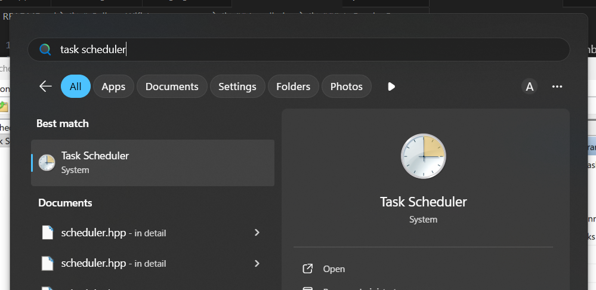

2. Create a **New Task**, name it anything you like.
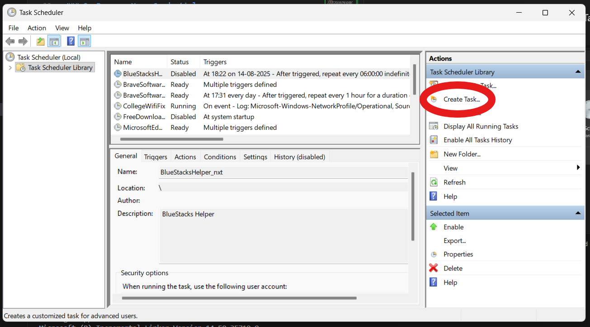
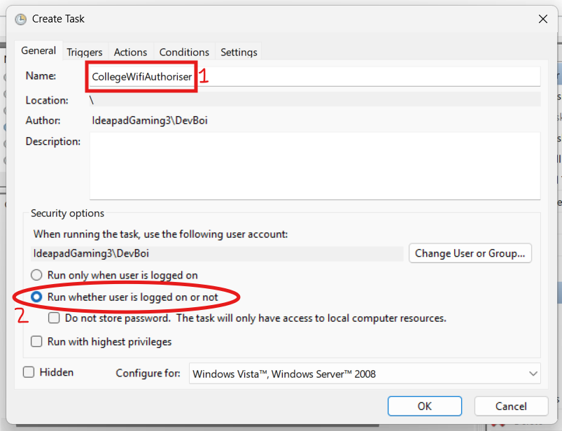

3. Fill in the following:
    #### **Triggers tab**
    1. Click New, in the Begin the task dropdown, select "On an event".
    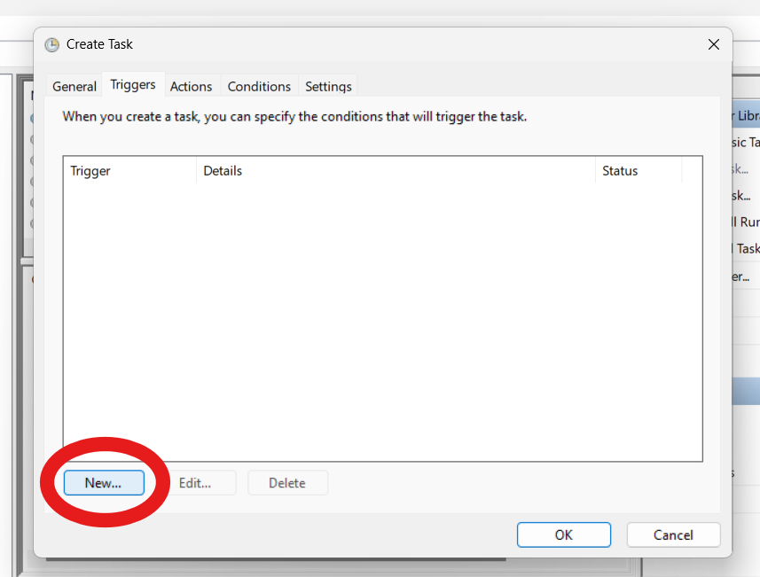
    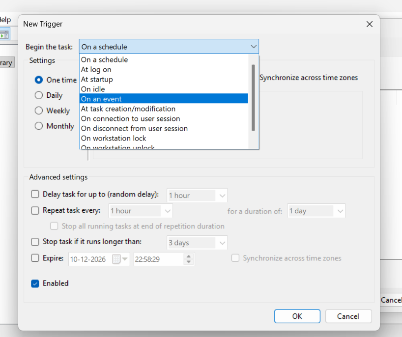

    2. Input the following details:
        - Log: `Microsoft-Windows-NetworkProfile/Operational`
        - Source: `Microsoft-Windows-NetworkProfile`
        - Event ID: `10000`
        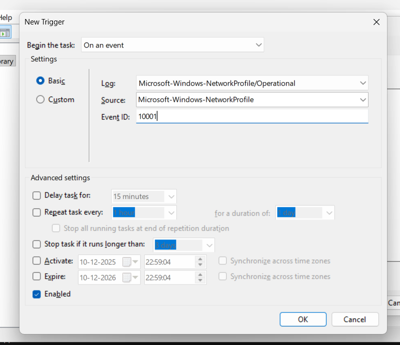

    This event makes it so that the tool runs and logs you in whenever a network is connected, so that you dont have to manually login.

    #### **Actions tab**
    1. Click New, using the Action: dropdown, select "Start a program"
    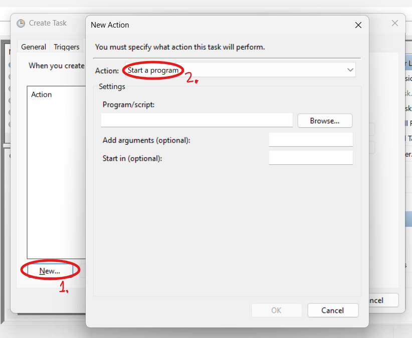

    2. In the Program/Script, browse to the location of the compiled binary (if you compiled it yourself), or the location of the wifitool.exe if you downloaded it from [releases](https://github.com/DevBoiAgru/HostelWifiAutoconnector/releases).
    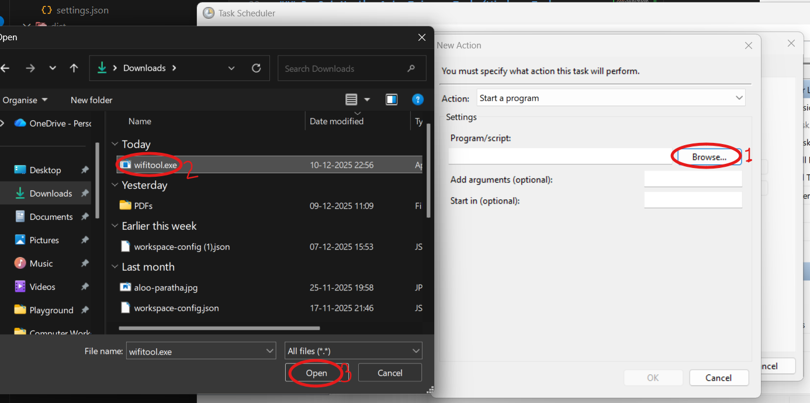

    3. In the Add arguments input, just input your username and password with a space in between. `25ABCD2004 password1234`
    
    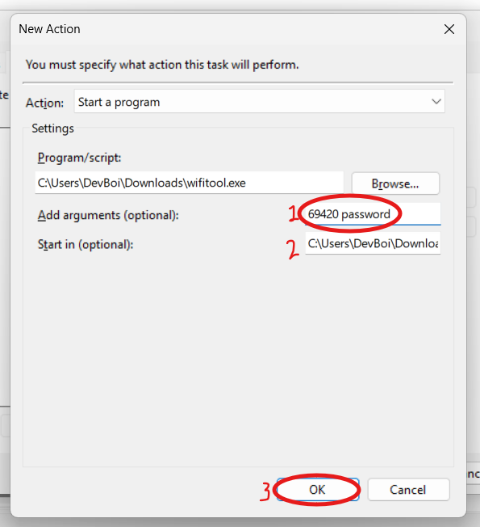

    4. Optional: In the Start in input, put the path of the folder wifitool.exe is located in. This will make it easier for you to find the tool's generated log file.
    5. Click Ok.

    6. **In the Conditions tab**, You might want to uncheck "Start the task only if the computer is on AC Power" if you have a laptop.
    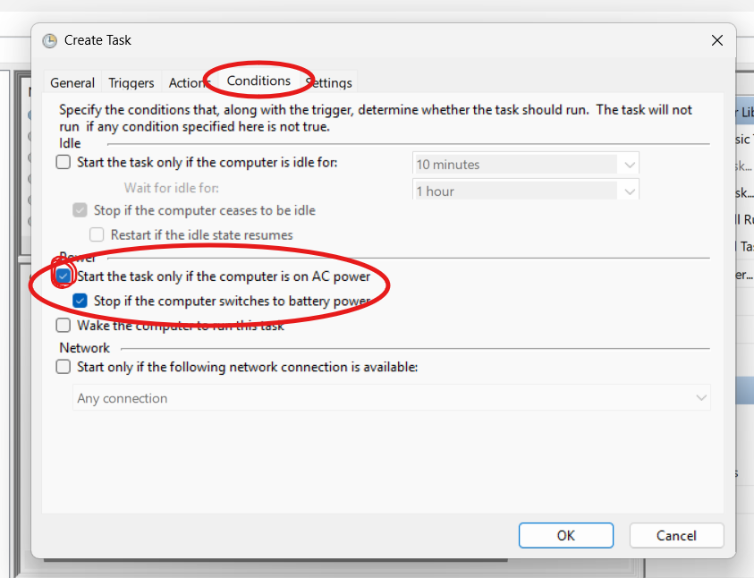

    7. In the Settings tab, in the If the task is already running dropdown, select "Stop the existing instance".
    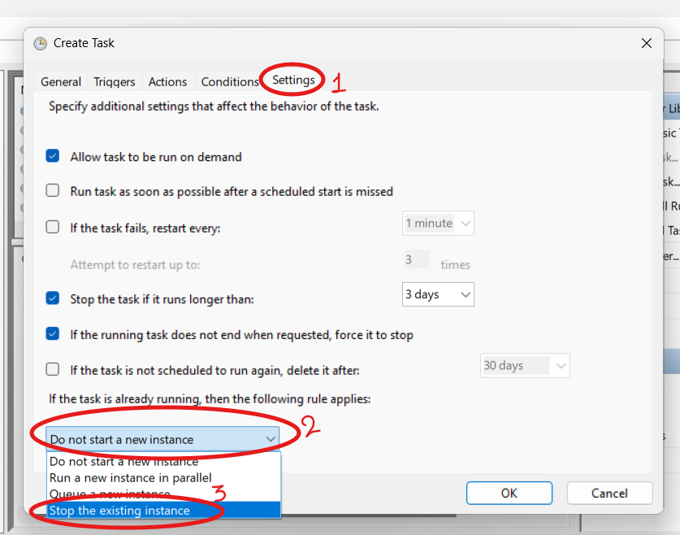

4. Restart your laptop for good measure, and the next time you connect to the college wifi, it should automatically log you in. To check if the program is running, check the `log.txt` generated where the program is saved, or open task manager and search for `wifitool.exe`

## License

This project is licensed under the MIT License. See the [LICENSE](LICENSE) file for details.